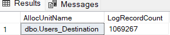
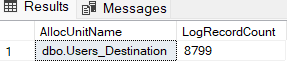
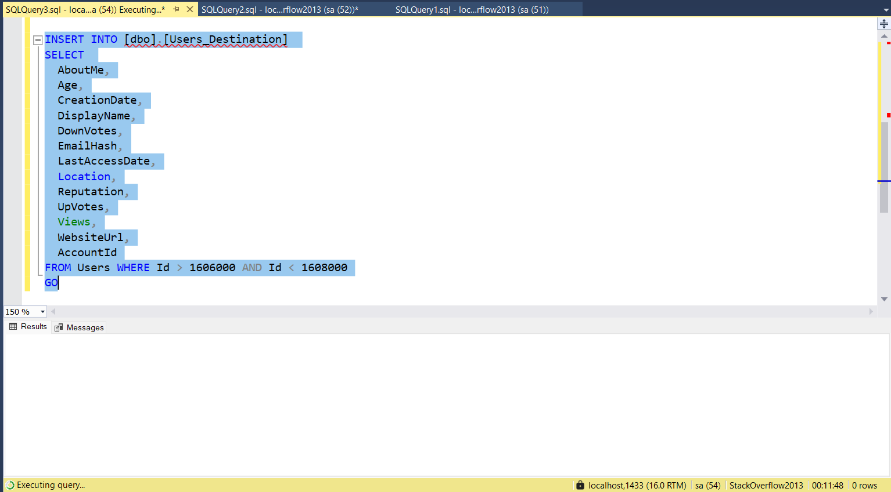
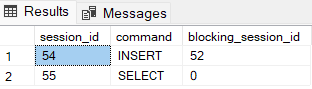

### Performance considerations when using TABLOCK hint for bulk inserts in SQL Server

The `TABLOCK` hint in SQL Server is a powerful tool for optimizing bulk insert operations, primarily by influencing the locking behavior and enabling minimal logging. However, its benefits come with trade-offs, particularly concerning concurrency.

#### Bulk insert without `TABLOCK` hint

We will use the Stack Overflow 2013 database. 

```
USE StackOverflow2013
GO
``` 

This is a crucial step for performance optimization in bulk inserts. Setting the database to the `SIMPLE` recovery model minimizes the transaction log size by automatically truncating it after checkpoints. For bulk inserts, this is a prerequisite for minimal logging, which significantly reduces the I/O overhead to the transaction log.

```
ALTER DATABASE CURRENT SET RECOVERY SIMPLE
GO
```

We ensure we are working on a clean slate by dropping the table if it exists. We create an empty table `Users_Destination`, whose columns have the same data types as the `Users` table of the Stack Overflow 2013 database. Then we perform a bulk insert into the `Users_Destination` table by selecting the first 1600000 records in the `Users` table.

```
DROP TABLE IF EXISTS [dbo].[Users_Destination]
GO
 
CREATE TABLE [dbo].[Users_Destination]
(
 [Id] [int] NOT NULL IDENTITY(1, 1),
 [AboutMe] [nvarchar](max) NULL,
 [Age] [int] NULL,
 [CreationDate] [datetime] NOT NULL,
 [DisplayName] [nvarchar](40) NOT NULL,
 [DownVotes] [int] NOT NULL,
 [EmailHash] [nvarchar](40) NULL,
 [LastAccessDate] [datetime] NOT NULL,
 [Location] [nvarchar](100) NULL,
 [Reputation] [int] NOT NULL,
 [UpVotes] [int] NOT NULL,
 [Views] [int] NOT NULL,
 [WebsiteUrl] [nvarchar](200) NULL,
 [AccountId] [int] NULL
)
GO

INSERT INTO [dbo].[Users_Destination] 
 (
  AboutMe,
  Age,
  CreationDate,
  DisplayName,
  DownVotes,
  EmailHash,
  LastAccessDate,
  Location,
  Reputation,
  UpVotes,
  Views,
  WebsiteUrl,
  AccountId
 )
SELECT 
  AboutMe,
  Age,
  CreationDate,
  DisplayName,
  DownVotes,
  EmailHash,
  LastAccessDate,
  Location,
  Reputation,
  UpVotes,
  Views,
  WebsiteUrl,
  AccountId
FROM Users WHERE Id < 1600000
GO
```


We run a query that inspects the transaction log to count the number of log records associated with the `Users_Destination` table. The `LogRecordCount` from this insert will be high, reflecting the full logging of each inserted row. This will serve as a comparison point for the using the `TABLOCK` hint later.

```
SELECT AllocUnitName, COUNT(*) AS LogRecordCount
FROM sys.fn_dblog(NULL,NULL)
WHERE AllocUnitName LIKE 'dbo.Users_Destination%'
GROUP BY AllocUnitName 
GO
```



#### Bulk insert with `TABLOCK` hint

We start by dropping the table then recreating it, like before.

```
DROP TABLE IF EXISTS [dbo].[Users_Destination]
GO

CREATE TABLE [dbo].[Users_Destination]
(
 [Id] [int] NOT NULL IDENTITY(1, 1),
 [AboutMe] [nvarchar](max) NULL,
 [Age] [int] NULL,
 [CreationDate] [datetime] NOT NULL,
 [DisplayName] [nvarchar](40) NOT NULL,
 [DownVotes] [int] NOT NULL,
 [EmailHash] [nvarchar](40) NULL,
 [LastAccessDate] [datetime] NOT NULL,
 [Location] [nvarchar](100) NULL,
 [Reputation] [int] NOT NULL,
 [UpVotes] [int] NOT NULL,
 [Views] [int] NOT NULL,
 [WebsiteUrl] [nvarchar](200) NULL,
 [AccountId] [int] NULL
)
GO
```

The `CHECKPOINT` command forces all dirty pages in the buffer cache for the current database to be written to disk and truncates the transaction log (in SIMPLE recovery model). This is important to ensure that the `LogRecordCount` accurately reflects only the activity from the subsequent insert, providing a clearer comparison to the baseline (bulk insert without `TABLOCK` hint). 

```
CHECKPOINT
GO
```

Next, we do a bulk insert like before, but including the `TABLOCK` hint this time.

``` 
INSERT INTO [dbo].[Users_Destination] WITH (TABLOCK)
 (
  AboutMe,
  Age,
  CreationDate,
  DisplayName,
  DownVotes,
  EmailHash,
  LastAccessDate,
  Location,
  Reputation,
  UpVotes,
  Views,
  WebsiteUrl,
  AccountId
 )
SELECT 
  AboutMe,
  Age,
  CreationDate,
  DisplayName,
  DownVotes,
  EmailHash,
  LastAccessDate,
  Location,
  Reputation,
  UpVotes,
  Views,
  WebsiteUrl,
  AccountId
FROM Users WHERE Id < 1600000
GO
```


This query will now show a significantly lower `LogRecordCount` compared to the first insert. This clearly demonstrates the benefit of minimal logging enabled by `TABLOCK` hint.

```
SELECT AllocUnitName, COUNT(*) AS LogRecordCount
FROM sys.fn_dblog(NULL,NULL)
WHERE AllocUnitName LIKE 'dbo.Users_Destination%'
GROUP BY AllocUnitName 
GO
```




#### `TABLOCK` and concurrency implications

To demonstrate implications on concurrency when using the `TABLOCK` hint, we start by adding a clustered primary key to the `Users_Destination` table. Once a clustered index is present, bulk inserts into the table will generally not be minimally logged, even with `TABLOCK`. For typical inserts into a non-empty clustered table, full logging will occur.

```
ALTER TABLE [dbo].[Users_Destination] ADD CONSTRAINT PK_Users_Destination PRIMARY KEY CLUSTERED (Id) 
GO
```

The query below shows 2 consecutive INSERT statements within a single transaction, without the `TABLOCK` hint, into the `Users_Destination` table which has a clustered index. 
First run the query below to insert 2000 records.

```
BEGIN TRANSACTION
INSERT INTO [dbo].[Users_Destination] 
SELECT 
  AboutMe,
  Age,
  CreationDate,
  DisplayName,
  DownVotes,
  EmailHash,
  LastAccessDate,
  Location,
  Reputation,
  UpVotes,
  Views,
  WebsiteUrl,
  AccountId
FROM Users WHERE Id > 1600000 AND Id < 1602000
GO
```

Then open a new query window and run the query below to insert another 2000 records.

```
INSERT INTO [dbo].[Users_Destination] 
SELECT 
  AboutMe,
  Age,
  CreationDate,
  DisplayName,
  DownVotes,
  EmailHash,
  LastAccessDate,
  Location,
  Reputation,
  UpVotes,
  Views,
  WebsiteUrl,
  AccountId
FROM Users WHERE Id > 1602000 AND Id < 1604000
GO
```

If another session attempts to insert data into a different range of the `Users_Destination` table while this transaction was active, both queries will be able to proceed without blocking.

Commit the transaction.

```
COMMIT TRANSACTION
GO
```

We try again using the `TABLOCK` hint this time, all within a single transaction. Run the query below. The `INSERT INTO [dbo].[Users_Destination] WITH (TABLOCK)` statement will acquire a table lock on the `Users_Destination` table. This lock will be held for the entire duration of the transaction until a `COMMIT TRANSACTION` command is issued.

```
BEGIN TRANSACTION
INSERT INTO [dbo].[Users_Destination] WITH (TABLOCK)
SELECT 
  AboutMe,
  Age,
  CreationDate,
  DisplayName,
  DownVotes,
  EmailHash,
  LastAccessDate,
  Location,
  Reputation,
  UpVotes,
  Views,
  WebsiteUrl,
  AccountId
FROM Users WHERE Id > 1604000 AND Id < 1606000
GO
```

Open a new query window and run the query below. Since the transaction above hasn't been committed yet, any other session attempting to perform any operation (read or write) on the `Users_Destination` table while this exclusive lock is held will be blocked indefinitely.

```
INSERT INTO [dbo].[Users_Destination] 
SELECT 
  AboutMe,
  Age,
  CreationDate,
  DisplayName,
  DownVotes,
  EmailHash,
  LastAccessDate,
  Location,
  Reputation,
  UpVotes,
  Views,
  WebsiteUrl,
  AccountId
FROM Users WHERE Id > 1606000 AND Id < 1608000
GO
```



We can use the query below to observe blocking. 

```
SELECT session_id, command, blocking_session_id 
FROM sys.dm_exec_requests 
WHERE session_id > 50 AND database_id = db_id ()
GO
```



As a result of the query above, we see the `session_id` of the blocked session, and its `blocking_session_id` points to the session holding the exclusive table lock. This clearly shows the concurrency limitation imposed by `TABLOCK` hint in SQL Server.